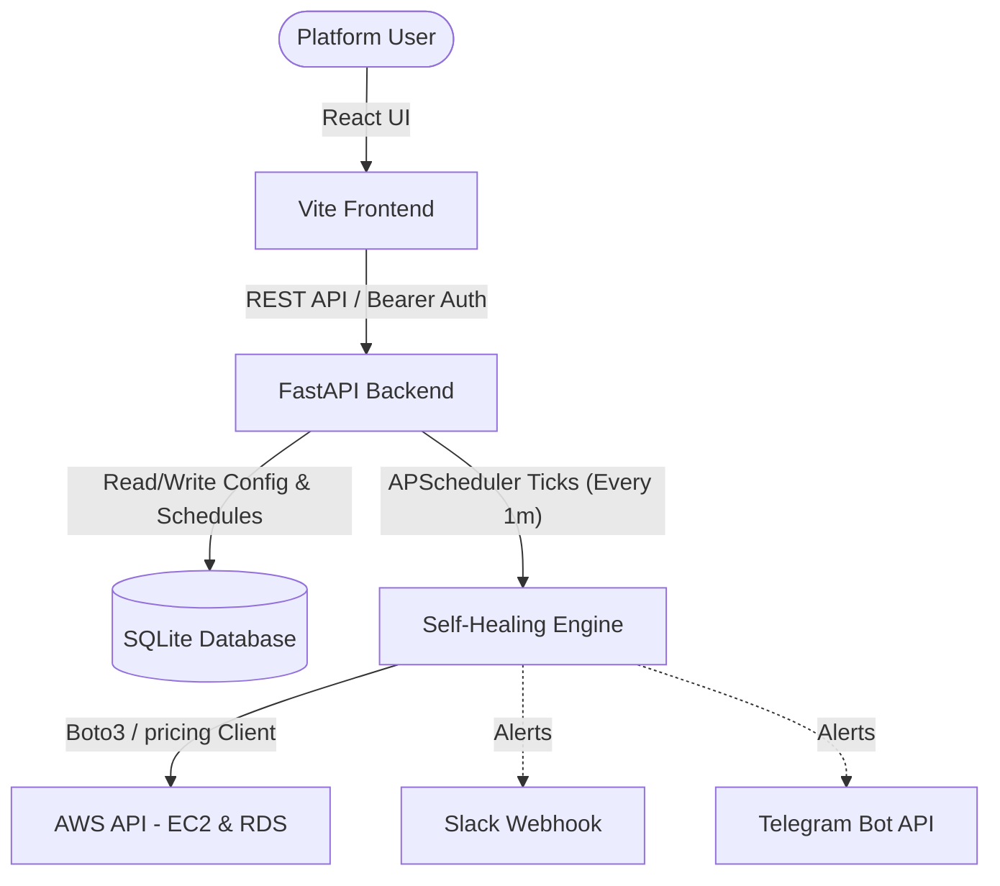

# CloudNap

[](LICENSE)
[](https://github.com/famirco/cloudnap/stargazers)
[](docker-compose.yml)
[](https://github.com/famirco/cloudnap)

An open-source, self-hosted AWS Instance Scheduler designed to run inside a single Docker container using Docker Compose. CloudNap helps you automatically schedule the shutdown and startup of AWS resources (EC2 and RDS) to optimize operations and cloud resource runtime.

---

## 🤔 Why CloudNap?

Managing AWS EC2 and RDS instances on a budget shouldn't require complex architectures or expensive third-party subscriptions. Here is how CloudNap compares to common AWS Cost Optimization practices:

| Feature | **CloudNap** 😴 | **AWS Instance Scheduler** | **SaaS Platforms** | **Manual Scripts** |
| :--- | :--- | :--- | :--- | :--- |
| **Deployment** | Single Docker Container | Heavy CloudFormation / Lambda | Third-party Connection | Cron on server / Local |
| **Pricing** | Free & Open Source | Pay-per-use (DynamoDB/Lambda) | Monthly Subscription | Free |
| **Live Cost Tracking** | Yes (AWS Pricing API) | No | Yes | No |
| **UI Dashboard** | Yes (Premium Dark/Light) | No | Yes | No |
| **TTL Lease Expiry** | Yes | No | Yes (Premium plans) | No |
| **GreenOps Impact** | Built-in tracking | No | Yes | No |

### 🎯 Key Use Cases
* **Development & QA Sandboxes**: Instantly shut down non-production servers overnight and on weekends to avoid idle bill runups.
* **Startups & SMBs**: Implement cloud cost-saving policies in 10 minutes without security approvals or platform subscription fees.
* **Temporary Lease Allocations**: Allocate cloud resources to contractors or sprints with a hard lease expiry time (TTL) to automatically prevent orphaned servers.
* **GreenOps & Carbon reduction**: Quantify active server sleeping hours to track resource footprint reduction.

---

## 🚀 Features

1. **Auto-Discovery**: Automatically scan and list EC2 and RDS instances across selected AWS regions.
2. **Date-Based Sleep Windows (Sleep Duration)**: Define date and time ranges (Turn OFF date to Turn ON date) where the resource must be stopped (sleeping). Outside of these ranges, the resource automatically runs.
3. **Recurring Sleep Schedules (Daily & Weekly)**: Define repeating daily or weekly sleep schedules (e.g. Turn OFF daily at 22:00 and Turn ON at 08:00 UTC, or select specific active days of the week).
4. **Searchable Audit Trail**: Interactive logs table displaying user actions (creating/deleting schedules, applying overrides) and system operations (`SYSTEM_START` / `SYSTEM_STOP`). Logs are tagged by resource and support text search.
5. **High-Contrast Light Theme**: Sleek UI styled using the custom brand colors matching the `logs.applinker.io` color scheme (Teal Blue `#0c586c`, Slate Gray `#5f6e79`, Soft Gray borders, and Light Blue-Grey background `#f0f4f8`).
6. **Resource Details Routing & Chronological View**: Clicking a resource card routes you to a dedicated detail page where all sleep schedules are displayed, sorted chronologically.
7. **Manual Controls & Holds**: Start or stop instances manually directly from the details view with a single click. The scheduler locks the state and pauses automated schedules until "Resume Schedule" is clicked.
8. **Operational Overview Dashboard**: Monitor your infrastructure at a glance with metrics showing Managed Resources, Scheduled Resources, Manual Holds, and Sleeping instances.
9. **Pure UTC Engine**: The calendar picker, time text fields, and scheduling backend run entirely on UTC. No local browser timezone conversions are applied.
10. **Conflict & Overlap Prevention**: The backend validates sleep windows on creation, rejecting overlapping date/time ranges.
11. **State-Based Self-Healing**: Scheduler ticks are range-based (every minute) rather than event-triggered, ensuring instances heal to their target state even after container restarts or host downtime.
12. **Mock Mode for Testing**: Run locally without any AWS credentials or active AWS resources by enabling `MOCK_AWS=true`.
13. **Slack & Telegram Integrations**: Real-time notifications dispatched to Slack incoming webhooks and Telegram Bot APIs on scheduling creations, override adjustments, and automated system state corrections. Features a dedicated sidebar **Settings** panel supporting active toggles, optional Slack channel overrides, and instant connection test message buttons.
14. **Resource Lease Expiry (TTL)**: Assign temporary leases to developers or teams by specifying a precise UTC lease expiration date and time. Once expired, the scheduler automatically stops the resource, locks it in a stopped state, and broadcasts alert notifications to Slack/Telegram.
15. **Cost Savings Dashboard & Analytics**: Live cost management dashboard tracking accumulated dollar savings and real-time hourly savings rate. Features an interactive information popup explaining the underlying math and formulas.
16. **Free AWS Pricing API Integration**: Automatically queries the official, free-of-charge AWS Price List Service API (`pricing`) to fetch exact hourly costs for active EC2 and RDS sizes based on region, with local in-memory caching and offline fallback cost tables.
17. **Dark & Light Themes**: Premium Dark mode styled with a high-end Dark Slate-Blue and Glowing Teal aesthetic, toggled from the bottom of the sidebar with persistent preference saving.

---

## 🛠️ Tech Stack

*   **Backend**: Python (FastAPI) + `boto3` (AWS SDK) + `APScheduler`.
*   **Database**: SQLite (SQLAlchemy) for persistent resource mappings, sleep schedules, action logs, and manual overrides.
*   **Frontend**: React (Vite) + Tailwind CSS + High-Contrast Light Theme, served statically by FastAPI.
*   **Containerization**: Docker & Docker Compose.

---

## 🏗️ Architecture



---

## 📂 Project Structure

```text
cloudnap/
├── backend/
│   ├── app/
│   │   ├── __init__.py
│   │   ├── main.py          # FastAPI entrypoint & static file mounting
│   │   ├── config.py        # Settings & environment variables
│   │   ├── db.py            # SQLite database & self-healing migrations
│   │   ├── models.py        # Database models (Resource, ResourceSchedule, ResourceOverride, ActionLog)
│   │   ├── schemas.py       # Pydantic validation schemas
│   │   ├── aws.py           # Boto3 logic & Mock AWS implementation
│   │   ├── scheduler.py     # Background state-based check job (every minute)
│   │   └── routes/
│   │       ├── auth.py      # Basic/Local password authentication
│   │       └── instances.py # Endpoints for resource management, active windows, and audit logs
│   ├── requirements.txt     # Python dependencies
│   └── Dockerfile           # Multi-stage build (React build + Python backend)
├── frontend/
│   ├── src/                 # React UI code (Components, Dashboards, api client)
│   ├── package.json         # Node dependencies
│   ├── tailwind.config.js   # Custom Tailwind theme (Glassmorphism)
│   └── vite.config.js       # Vite configuration
├── docker-compose.yml       # Production-ready compose configuration
├── LICENSE                  # MIT License
└── README.md                # Documentation (this file)
```

---

## 🚀 Quick Start (Run with Docker Compose)

The easiest way to run CloudNap locally or in production is using Docker Compose:

1. **Clone the repository**:
   ```bash
   git clone https://github.com/your-username/cloudnap.git
   cd cloudnap
   ```

2. **Configure environment variables**:
   Create a `.env` file in the `backend/` directory:
   ```env
   MOCK_AWS=true
   APP_PASSWORD=secret123
   DATABASE_URL=sqlite:///./data/cloudnap.db
   ```
   *Note: Set `MOCK_AWS=false` and configure standard AWS environment variables (`AWS_ACCESS_KEY_ID`, `AWS_SECRET_ACCESS_KEY`, `AWS_DEFAULT_REGION`) to connect to actual AWS resources.*

3. **Launch the stack**:

   Using **Docker Compose**:
   ```bash
   docker compose up --build -d
   ```

   Using **Docker Swarm** (`docker stack deploy`):
   ```bash
   # Build the image first (since Swarm stack deploy doesn't support the 'build' key)
   docker build -t cloudnap:latest -f backend/Dockerfile .
   
   # Deploy the stack
   docker stack deploy -c docker-stack.yml cloudnap
   ```

4. **Access the web panel**:
   Open [http://localhost:8080](http://localhost:8080) and authenticate using your password (`secret123`).

5. **Health Checks**:
   If deploying behind an AWS Application Load Balancer (ALB), configure your Target Group health check with:
   *   **Path**: `/api/auth/status`
   *   **Port**: `8080` (public JSON status endpoint, returns `200 OK`)

---

## 🧪 Running Tests

You can execute the automated test suite inside the running Docker container:

```bash
docker compose exec cloudnap pip install pytest
docker compose exec cloudnap python -m pytest backend/tests -v
```

Or run them locally on your host machine:

```bash
cd backend
python3 -m pytest tests -v
```

---

## 🤝 Contributing

We love contributions! You can easily develop and test CloudNap locally without having an AWS account by utilizing the Mock AWS Mode.

For detailed instructions on running backend hot-reloading, frontend dev servers, and code standards, please read our **[Contributing Guide](file:///Users/amir/Desktop/cloudnap/CONTRIBUTING.md)**.

---

## 🔒 Required AWS IAM Permissions

If deploying to AWS (with `MOCK_AWS=false`), the IAM role running the container requires the following permissions:

```json
{
  "Version": "2012-10-17",
  "Statement": [
    {
      "Effect": "Allow",
      "Action": [
        "ec2:DescribeInstances",
        "ec2:StartInstances",
        "ec2:StopInstances",
        "ec2:DescribeRegions",
        "rds:DescribeDBInstances",
        "rds:StartDBInstance",
        "rds:StopDBInstance",
        "pricing:GetProducts"
      ],
      "Resource": "*"
    }
  ]
}
```

---

## 🌐 Multi-AWS Account Scaling

CloudNap is designed to scale across multiple AWS Accounts from a single dashboard. You can add external accounts under the **AWS Accounts** tab using two methods:

### 1. Cross-Account IAM Role Assumption (Recommended)
This method allows CloudNap to securely manage resources in target accounts without storing long-lived access keys.

To set this up:
1. In the target account, create an IAM Role (e.g. `CloudNapCrossAccountRole`) with the [Required AWS IAM Permissions](#-required-aws-iam-permissions).
2. Configure the role's **Trust Relationship** to trust the main account where CloudNap is running:

```json
{
  "Version": "2012-10-17",
  "Statement": [
    {
      "Effect": "Allow",
      "Principal": {
        "AWS": "arn:aws:iam::MAIN_ACCOUNT_ID:root"
      },
      "Action": "sts:AssumeRole",
      "Condition": {
        "StringEquals": {
          "sts:ExternalId": "YOUR_OPTIONAL_EXTERNAL_ID"
        }
      }
    }
  ]
}
```
3. Add the role's ARN and external ID (if set) in CloudNap's dashboard.

### 2. Static Access Keys
Alternatively, you can connect accounts by providing standard AWS Access Keys. All credentials are **AES-256 Fernet encrypted at rest** in your SQLite database using either the `ENCRYPTION_KEY` environment variable or a stable key derived from your `APP_PASSWORD` fallback.

